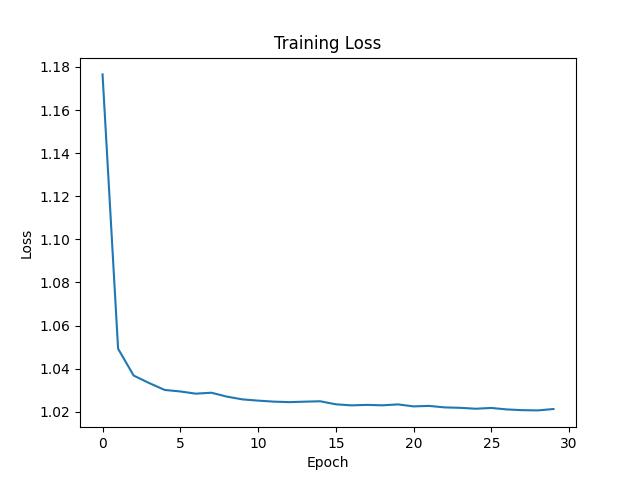

#### 基于SRResNet的图像超分辨率重建(Pytorch实现)
SRResNet 网络来源于SRGAN的生成器，允许修复更高频的细节。
SRResNet上存在两个小的更改：一个是 SRResNet 使用 Parametric ReLU 而不是 ReLU，ReLU 引入一个可学习参数帮助它适应性地学习部分负系数；另一个区别是 SRResNet 使用了图像上采样方法，SRResNet 使用了子像素卷积层2。
#### 训练环境
数据集来源于Urban100数据集，并进了一些处理  
RTXA4000(16GB),30 epoch，128 batchsize，花了不到10分钟，占用约30%，感觉RTX3060（6GB）笔记本就能训练

#### 训练效果

最后的参数文件保存在 model.pth里面
